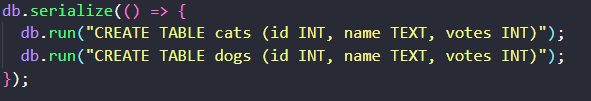
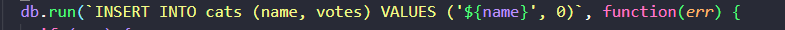
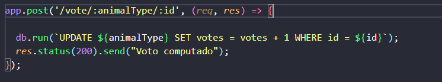
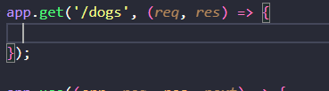
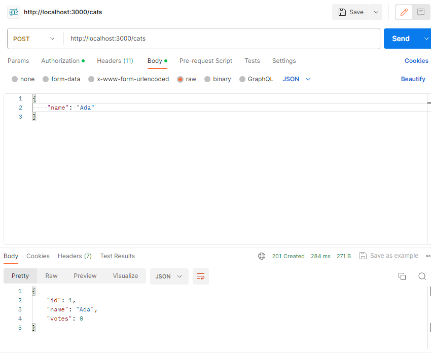
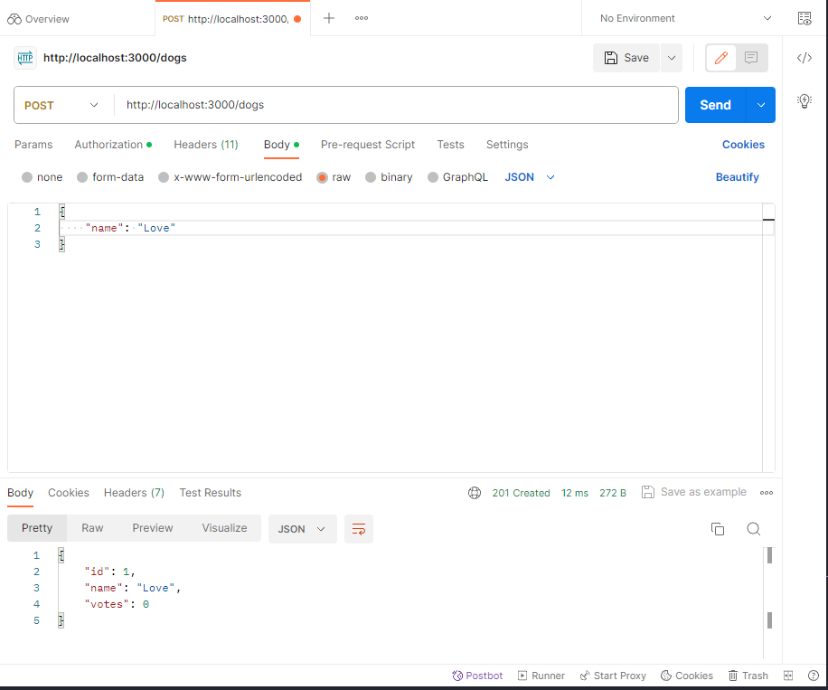
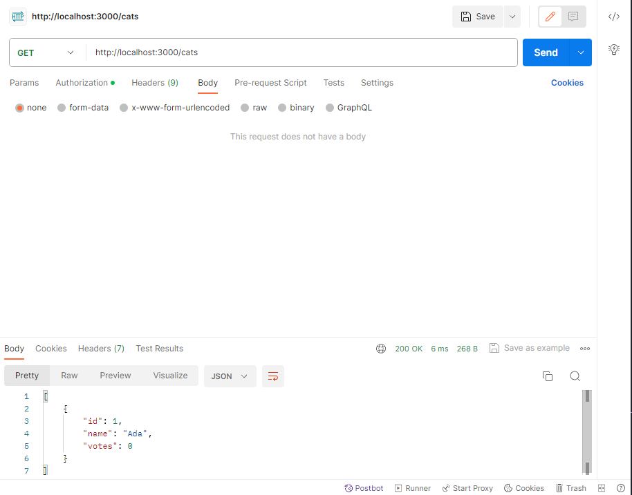
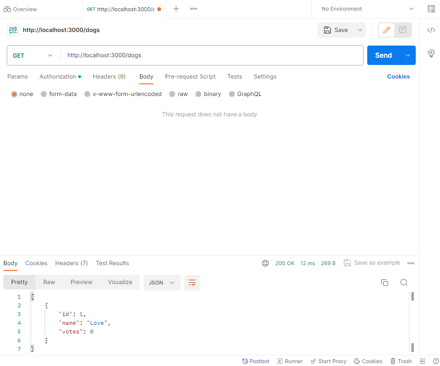

# 20232BSET03P2
Inteli - Engenharia de Software | Avaliação 2023-2B P2 - Daniel Cunha

## Auto increment

  

O campo de id não estava com Auto increment ativado, o que foi adicionado na versão final.

## SQL INJECTION

  

  

Tanto na parte de inserção de novos dados quanto no update de votos, estariam suscetíveis a SQL Injection, no código atual, eu fiz alterações adicionando placeholders no comando SQL e validações no UPDATE para verificar se existe o id e se o animalType é o mesmo das tabelas.

## GET e POST de dogs vazio

  

As rotas de dogs, tanto para post quanto para get estavam vazias, eu adotei a mesma lógica utilizada nas rotas de cats, com validações e prevenções de SQL Injection

## Testes

  

  

Nesse momento eu realizei o teste de inserir 2 animais, um gato e um cachorro utilizando as duas rotas e o método post.

  

  

E nesse momento eu testei o método de GET para verificar se os mesmos estavams no banco de dados e as rotas estavam funcionando.